# classes.jacobdanderson.net

Course library and supporting site assets for `instruction-material/classes.jacobdanderson.net`.

## Repo Layout

- `front-end/` - Vite SSG application for the public course library
- `back-end/` - Legacy Express + MongoDB application code kept in the monorepo

## Curriculum Paths

The diagram below summarizes the current course catalog and the most likely
next-step branches for students exploring the material.

```mermaid
flowchart TD
    subgraph VisualPython["Visual, Python, and AI Path"]
        Scratch1["Scratch Level 1"] --> Scratch2["Scratch Level 2"]
        Scratch2 --> Python1["Python Level 1"]
        Python1 --> Python2["Python Level 2"]
        Python1 --> PyGames["PyGames"]
        Python2 --> Python3["Python Level 3"]
        Python3 --> MachineLearning["Machine Learning"]
    end

    subgraph JavaPath["Java and Object-Oriented Design Path"]
        Java1["Java Level 1"] --> Java2["Java Level 2"]
        Java2 --> Java3["Java Level 3"]
    end

    subgraph SystemsSecurity["Systems and Security Path"]
        Cpp1["C++ Level 1"] --> LowLevelSecurity["Low Level Security"]
    end

    subgraph WebPath["JavaScript and Web Path"]
        JS1["JavaScript Level 1"] --> JS2["JavaScript Level 2"]
    end

    subgraph ScienceApps["Science and App Development Path"]
        Physics1["Intro to Physics"] --> Physics2["Physics Level 2"]
        SwiftIntro["Intro to Swift App Development"]
    end
```



## Common Commands

```bash
npm install
npm run dev
npm run serve
npm run server
npm run build
npm run lint
```

## Notes

- The public course library is surfaced from the front-end at `/courses`.
- Course data is stored in `front-end/src/stores/courses/`.
- The downstream site intentionally avoids personal scheduling, billing, or private admin content in its public navigation and copy.
