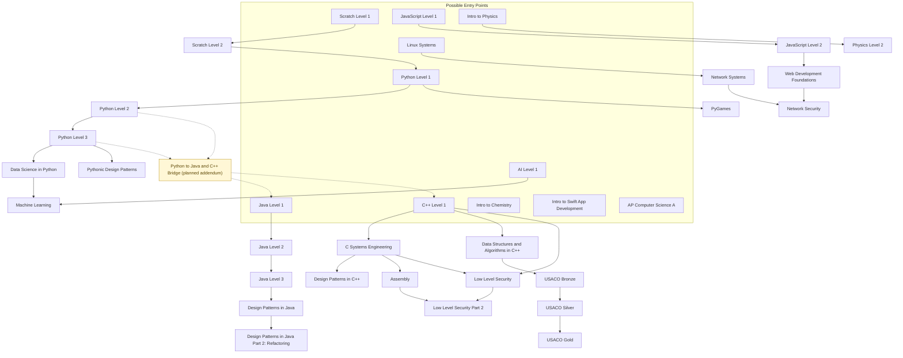

# classes.jacobdanderson.net

Website and supporting API for `classes.jacobdanderson.net`.

## Repo Layout

- `front-end/` - Vite SSG application
- `back-end/` - Express + MongoDB API
- `HEALTHCHECKS.md` - monitor endpoints and expected `200`/`503` behavior

## Curriculum Paths

The diagram below reads from top to bottom. The top row shows possible entry
points into the catalog, and dashed arrows show optional bridge or transition
paths. Plain labels are current courses. Nodes marked `(planned)` are roadmap
items from the course-planning docs rather than live standalone catalog
entries.



## Common Commands

```bash
npm install
npm run dev
npm run server
npm run serve
npm run build
npm run up
```

## Operational Notes

- The root `package-lock.json` is the authoritative lockfile for the repo. Keep it updated whenever dependencies change.
- Use `npm run server` and `npm run serve` when you want the API and front-end started separately.
- Use [`HEALTHCHECKS.md`](./HEALTHCHECKS.md) for deployment monitor targets instead of `/`.
